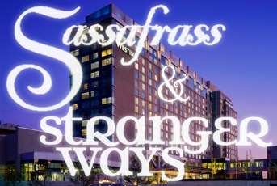

**Where:** [Arisia 2011][2] at the Westin Waterfront Hotel, Boston, MA 
**When:** Saturday, January 15, 2011 · noon – 2:00pm 
*(Note: time has changed from original announcement.  The concert will start at noon, not 11:00.)* 
[**RSVP on Facebook**][3]

We’re pleased to announce that Stranger Ways will be performing at Arisia 2011, one of Boston’s premier sci-fi/fantasy/fan conventions. We will play a two-hour joint set with [Sassafrass][4], a Pegasus award-nominated fantasy folk a capella group.

The set will include some brand new arrangements of Stranger Ways and Sassafrass tunes that incorporate both groups. We’re also hoping to have CDs available for sale at Arisia.

We hope to see y’all there!

 [1]: /images/Sassafrass-and-Stranger-Ways-Arisia.jpg
 [2]: http://2011.arisia.org/
 [3]: http://www.facebook.com/event.php?eid=143751252339025
 [4]: http://adapalmer.com/sassafrass
